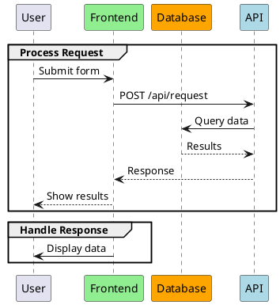
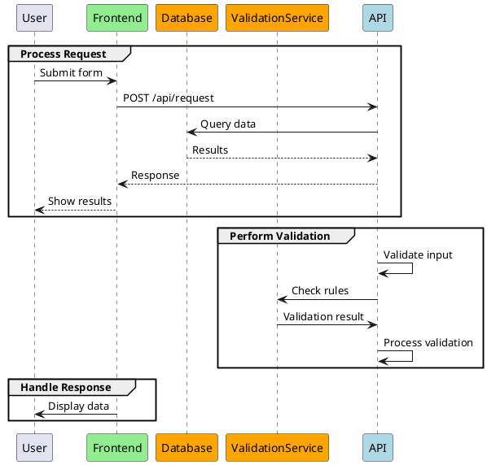

# PlantUML Manipulator - Technical Specification

## Purpose

A CLI tool for structured manipulation of PlantUML sequence diagrams, particularly for repetitive operations like inserting code blocks at specific locations in multiple files.

## Primary Use Cases

1. **Insert Block After Group**: Insert a PlantUML block after a specific group in multiple files
2. **Add Participant**: Insert a new participant at the correct position in the declaration list
3. **Validation**: Check if specific structures exist in diagrams
4. **Reporting**: Create overviews of groups, participants, etc.

## Command-Line Interface

### 1. Insert Block After Group

```bash
# Basic syntax
plantuml-manipulator insert-after \
  --pattern "*.puml" \
  --after-group "Process Request" \
  --block-file snippets/validation.puml \
  --dry-run

# With filtering: only files containing specific participants
plantuml-manipulator insert-after \
  --pattern "diagrams/**/*.puml" \
  --after-group "Process Request" \
  --block-file snippets/validation.puml \
  --only-if-has-participant "PaymentService" \
  --verbose

# Skip files that already have the block
plantuml-manipulator insert-after \
  --pattern "diagrams/**/*.puml" \
  --after-group "Process Request" \
  --block-file snippets/validation.puml \
  --skip-if-exists "Perform Validation"
```

### 2. Add Participant

```bash
# Basic syntax
plantuml-manipulator add-participant \
  --pattern "*.puml" \
  --participant 'participant "API" as API #orange' \
  --after-participant "Frontend" \
  --dry-run

# Example: Insert participant after another
plantuml-manipulator add-participant \
  --pattern "diagrams/**/*.puml" \
  --participant 'participant "ValidationService" as ValidationService #orange' \
  --after-participant "Database" \
  --skip-if-exists "ValidationService"
```

### 3. Validation

```bash
# Check if all files have a specific group
plantuml-manipulator validate \
  --pattern "diagrams/**/*.puml" \
  --require-group "Perform Validation" \
  --require-participant "API" \
  --report-format table

# Output:
# File                     | Has Group | Has API
# -------------------------|-----------|--------
# user_login.puml          | ✓         | ✓
# payment_process.puml     | ✗         | ✗
# ...
```

### 4. Reporting

```bash
# List all groups in all files
plantuml-manipulator report groups \
  --pattern "diagrams/**/*.puml" \
  --format json

# List all participants
plantuml-manipulator report participants \
  --pattern "diagrams/**/*.puml" \
  --format table

# Show structure of a single file
plantuml-manipulator report structure \
  --file "diagrams/user_login.puml"
```

## Example Files

### Input: Original PlantUML File

**before.puml:**


### Snippet: Block to Insert

**snippets/validation.puml:**
```plantuml
group Perform Validation
    API -> API: Validate input
    API -> ValidationService: Check rules
    ValidationService -> API: Validation result
    API -> API: Process validation
end group
```

### Output: Modified File

**after.puml:**


## Technical Details

### Parsing Strategy

Since PlantUML has no official Python parsing library, the tool uses a **structure-based text approach**:

1. **Line-based Parsing**: Each line is analyzed
2. **State Machine**: Tracks context (in group, in participant declaration, etc.)
3. **Indentation-Aware**: Respects indentation when inserting
4. **Pattern Matching**: Regex for group names, participant declarations

### Data Structures

```python
@dataclass
class PlantUMLFile:
    path: Path
    lines: List[str]
    participants: List[Participant]
    groups: List[Group]

@dataclass
class Participant:
    line_number: int
    name: str
    alias: str
    color: Optional[str]
    raw_line: str

@dataclass
class Group:
    line_number: int
    name: str
    start_line: int
    end_line: int
    content: List[str]
```

### Core Algorithms

#### 1. Group Finder

```python
def find_group_end_line(lines: List[str], group_name: str) -> Optional[int]:
    """
    Find the line after 'end group' for a given group.

    Returns:
        Line number after 'end group' or None if not found
    """
    in_target_group = False
    group_depth = 0

    for i, line in enumerate(lines):
        if re.match(rf'^\s*group\s+{re.escape(group_name)}', line):
            in_target_group = True
            group_depth = 1
        elif in_target_group and 'group' in line and 'end' not in line:
            group_depth += 1
        elif in_target_group and 'end group' in line:
            group_depth -= 1
            if group_depth == 0:
                return i + 1  # Position after 'end group'

    return None
```

#### 2. Block Inserter

```python
def insert_block_after_group(
    file_lines: List[str],
    after_group: str,
    block_lines: List[str]
) -> List[str]:
    """
    Insert a block after a group.

    Args:
        file_lines: Original file content as lines
        after_group: Name of the group after which to insert
        block_lines: Lines to insert

    Returns:
        Modified lines
    """
    insert_pos = find_group_end_line(file_lines, after_group)

    if insert_pos is None:
        raise ValueError(f"Group '{after_group}' not found")

    # Insert empty line before block
    new_lines = file_lines[:insert_pos]
    new_lines.append('')
    new_lines.extend(block_lines)
    new_lines.extend(file_lines[insert_pos:])

    return new_lines
```

#### 3. Participant Finder

```python
def find_participant_insert_position(
    lines: List[str],
    after_participant: str
) -> Optional[int]:
    """
    Find the position where a new participant should be inserted.

    Args:
        lines: File content
        after_participant: Name of participant after which to insert

    Returns:
        Line number for insertion or None
    """
    participant_pattern = re.compile(
        r'^\s*participant\s+"?([^"]+)"?\s+as\s+(\w+)'
    )

    for i, line in enumerate(lines):
        match = participant_pattern.match(line)
        if match and after_participant in line:
            return i + 1

    return None
```

### Error Handling

```python
class PlantUMLManipulatorError(Exception):
    """Base exception for all tool errors"""
    pass

class GroupNotFoundError(PlantUMLManipulatorError):
    """Group was not found"""
    pass

class ParticipantNotFoundError(PlantUMLManipulatorError):
    """Participant was not found"""
    pass

class InvalidPlantUMLError(PlantUMLManipulatorError):
    """Invalid PlantUML syntax"""
    pass
```

### Options and Flags

#### Global Options

- `--dry-run`: Show changes but don't execute them
- `--verbose` / `-v`: Detailed output
- `--quiet` / `-q`: No output except errors
- `--backup`: Create .bak files before changes
- `--force`: Overwrite without confirmation

#### Filter Options

- `--pattern <glob>`: File pattern (e.g., `*.puml`)
- `--only-if-has-participant <name>`: Only files with specific participant
- `--only-if-has-group <name>`: Only files with specific group
- `--skip-if-exists <pattern>`: Skip files that already contain pattern

## Output Formats

### Verbose Mode

```
Processing: user_login.puml
  ✓ Found group "Process Request" at line 12
  ✓ ValidationService participant not found, will be added
  → Inserting block at line 20
  ✓ Adding participant "ValidationService" after "Database"
  ✓ File updated successfully

Processing: payment_process.puml
  ✓ Found group "Process Request" at line 15
  ✓ ValidationService participant not found, will be added
  → Inserting block at line 25
  ✓ Adding participant "ValidationService" after "Database"
  ✓ File updated successfully

Summary:
  Files processed: 8
  Files modified: 8
  Files skipped: 0
  Errors: 0
```

### Dry-Run Mode

```
[DRY RUN] Would modify: user_login.puml
  Changes:
    + Add participant "ValidationService" as ValidationService #orange after line 5
    + Insert block "Perform Validation" after line 20

[DRY RUN] Would modify: payment_process.puml
  Changes:
    + Add participant "ValidationService" as ValidationService #orange after line 5
    + Insert block "Perform Validation" after line 25

[DRY RUN] Summary:
  Files that would be modified: 8
  No files will be changed (dry-run mode)
```

### JSON Report

```json
{
  "files_processed": 8,
  "files_modified": 8,
  "files_skipped": 0,
  "errors": [],
  "modifications": [
    {
      "file": "user_login.puml",
      "changes": [
        {
          "type": "add_participant",
          "participant": "ValidationService",
          "line": 6
        },
        {
          "type": "insert_block",
          "after_group": "Process Request",
          "line": 20,
          "block_lines": 8
        }
      ]
    }
  ]
}
```

## Test Cases

### Unit Tests

1. **Group Finding**
   - Find simple group
   - Distinguish nested groups
   - Group not found → Exception

2. **Block Insertion**
   - Insert block after group
   - Preserve indentation
   - Prevent multiple insertions

3. **Participant Handling**
   - Add participant
   - Determine correct position
   - Detect duplicates

### Integration Tests

1. **End-to-End**: Original → Snippet → Expected Result
2. **Batch Processing**: Multiple files simultaneously
3. **Error Recovery**: Error in one file doesn't break all

## Dependencies

```txt
# requirements.txt
click>=8.1.0          # CLI framework
rich>=13.0.0          # Terminal formatting
```

## Implementation Roadmap

### Phase 1: MVP
- `insert-after` command
- `add-participant` command
- `--dry-run` and `--verbose` flags
- Basic error handling

### Phase 2: Validation
- `validate` command
- `report` command
- JSON output

### Phase 3: Robustness
- Backup system
- Better error handling
- Unit tests

### Phase 4: Advanced Features
- Interactive mode
- Undo functionality
- Plugin system

## Open Questions

1. **Encoding**: UTF-8 as default? Support other encodings?
2. **Backup Strategy**: `.bak` files or Git integration?
3. **Config File**: YAML/TOML for frequently used operations?
4. **Interactive Mode**: Ask before each change?
